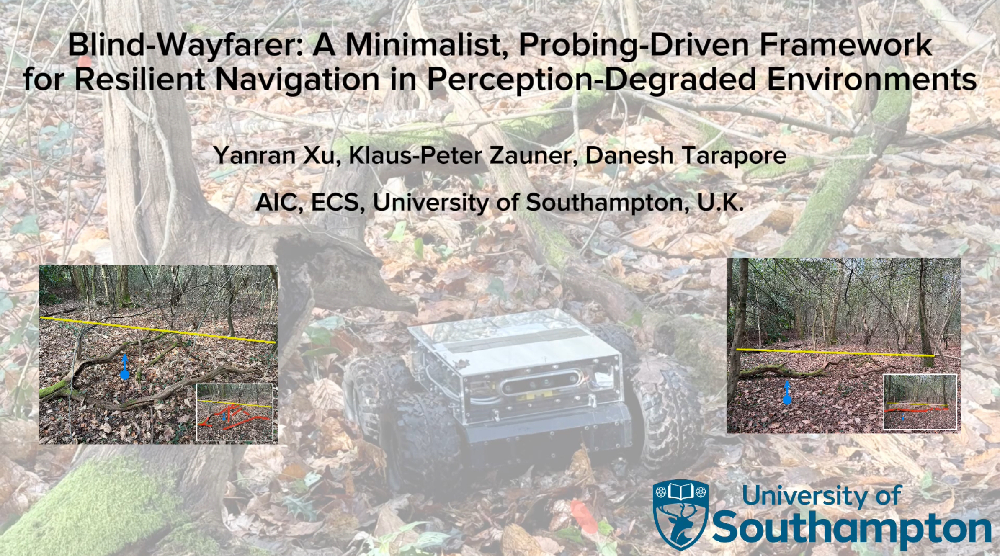
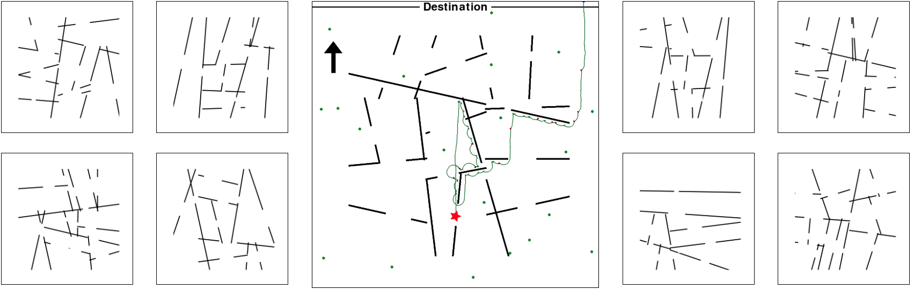

<h1 align="center">
  <br>
  Blind-Wayfarer
  <br>
</h1>

### **Happy to announce that our paper has been accepted for publication at the IEEE/RSJ International Conference on Intelligent Robots and Systems (IROS) 2025!**


<!--  -->

Navigating autonomous robots through dense forests and rugged terrains is especially daunting when exteroceptive sensors---such as cameras and LiDAR sensors---fail under occlusions, low-light conditions, or sensor noise. We present Blind-Wayfarer, a probing-driven navigation framework inspired by maze-solving algorithms that relies primarily on a compass to robustly traverse complex, unstructured environments. In 1,000 simulated forest experiments, Blind-Wayfarer achieved a 99.7\% success rate. In real-world tests in two distinct scenarios---with rover platforms of different sizes---our approach successfully escaped forest entrapments in all 20 trials. Remarkably, our framework also enabled a robot to escape a dense woodland, traveling from 45 m inside the forest to a paved pathway at its edge. These findings highlight the potential of probing-based methods for reliable navigation in challenging perception-degraded field conditions. Videos and supplementary materials are available on our website: https://sites.google.com/view/blind-wayfarer

## Features
- No reliable perception
- No accurate localization
- Relies on compass, IMU, and optical motion detector
- Robust traversal through probing-driven interaction and systematic entrapment recovery

## Abstract Forest Simulation

<!--  -->
### Setup
```bash
git clone git@github.com:Xu-Yanran/blind_wayfarer.git
pip install -r simulator/requirements.txt
```
### Run the simulation
The simulator can be adjusted based on following parameters:
- env_seed: The random seed to change the position and orientation of main obstacles in the simulation
- noise_seed: The random seed to change the noise of steering control, compass reading, and wheel slippage. 
```python
# Manual control
python simulator/sim_main.py --alg=manual --env_seed=2 --noise_seed=2025

# Forest-Pledge
python simulator/sim_main.py --alg=forest_Pledge --env_seed=2 --noise_seed=2025
```


## Real World Deployment
### Hardware Requirements
- **Compass Sensor:** CMPS14 or equivalent for global heading reference. 
- **IMU:** For monitoring pitch and detecting flip-over risk
- **Optical Flow Sensor:** (or camera-based motion detector) for immobilization detection.
- **Motor Driver:** Cimpatible with your robotic platform to execute motion command
- **Onboard Computer:** Raspberry Pi 5 or equivalent.

### Setup
  - Clone the repository and install the required dependencies.
  - Ensure the Hardware Abstraction Layer (HAL) is correctly configured for your specific sensors and motor driver.
  - Adjust configuration parameters (e.g., speed, turning angle, safety thresholds) in the code as needed.

### Deployment
The core logic of Blind-Wayfarer is independent of ROS, allowing you to port the implementation to pure Python or C++ by replacing ROS-specific components (e.g., publishers, subscribers, spinning loops) with standard equivalents.

**ROS2 Humble Implementation:**  
```bash
# Create your workspace and package:
mkdir -p ~/ros2_ws/src
cd ~/ros2_ws/src
```

Deploy blind_wayfarer module and HAL on your platform
- [blind_wayfarer](https://github.com/Xu-Yanran/blind_wayfarer/blob/main/robot_deployment/blind_wayfarer.py)
- [Hardware Abstraction Layer (HAL)](https://github.com/Xu-Yanran/blind_wayfarer/blob/main/robot_deployment/hal.py)

```bash
# Launch the blind_wayfarer node
ros2 run <package_name> blind_wayfarer
```
